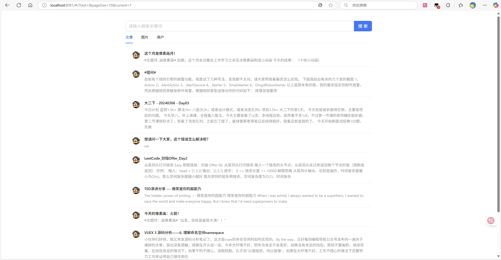
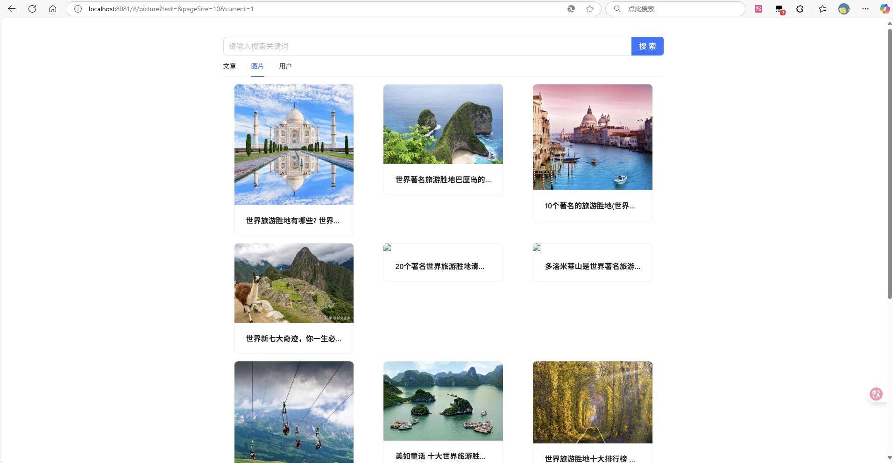
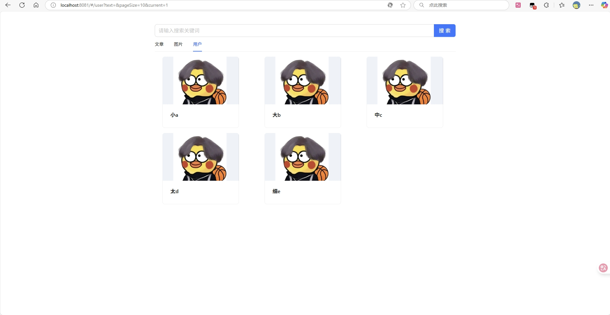

# multi-search-platform
一站式聚合搜索平台，基于 Vue 3 前端 + Spring Boot 后端 + Elastic Stack 的 全栈项目。

对用户来说，使用该平台，可以在同一个页面集中搜索出不同来源、不同类型的内容，提升用户的检索效率和搜索体验。

对企业来说，当企业内部有多个项目的数据都存在搜索需求时，无需针对每个项目单独开发搜索功能，可以直接将各项目的数据源接入搜索中台，从而提升开发效率、降低系统维护成本。

# 一、技术栈

前端：Vue3 + Ant Disign Vue + Axios

后端：SpringBoot3 + MySQL + Elastic Stack + MyBatis + MyBatis-plus + MyBatis X 自动生成 + Hutool + Swagger + Jsoup

设计模式：门面模式 + 适配器模式 + 注册器模式

# 二、业务流程

1. 先得到各种不同分类的数据

2. 提供一个搜索页面（单一搜索+聚合搜索），支持搜索

还可以做一些优化，比如关键词高亮、搜索建议、防抖节流。

项目架构图：

# 三、项目截图

文章搜索

图片搜索

用户搜索

