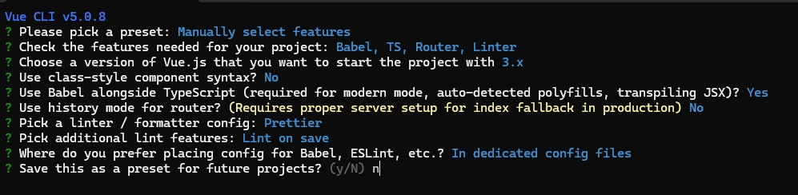

1. 初始化ant-design-vue 项目

官方文档：[Ant Design Vue](https://2x.antdv.com/docs/vue/getting-started-cn)

```
安装脚手架
npm install -g @vue/cli

vue create muitl-search-web
```

初始化过程选择：



2. 安装组件库

```
npm i --save ant-design-vue@next
```

修改main.ts

```
import { createApp } from "vue";
import App from "./App.vue";
import router from "./router";
import Antd from "ant-design-vue";
import "ant-design-vue/dist/reset.css";

createApp(App).use(Antd).use(router).mount("#app");
```

